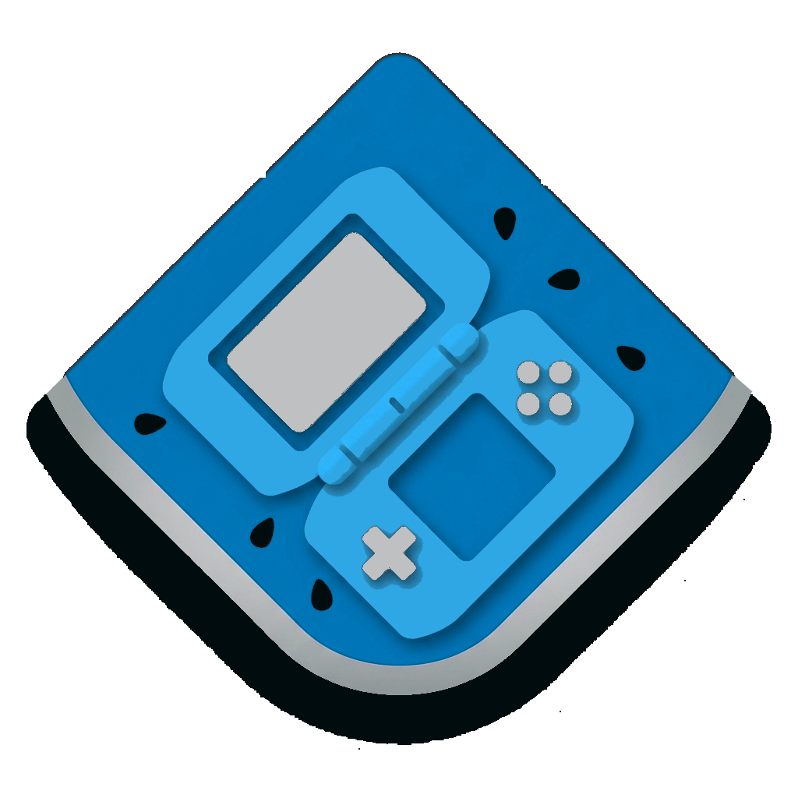

  

<h2 align="center"><b>MelonDS - Ixranium Fork</b></h2>

  
  
  
  

An Unofficial Fork Of MelonDS.

DS emulator, sorta

The goal is to do things right and fast, akin to blargSNES (but hopefully better). But also to, you know, have a fun challenge :)

## What's different from upstream melonDS

This fork keeps the core emulation code untouched and focuses on the Qt
frontend (`src/frontend/qt_sdl`):

* **Custom frameless window** — own titlebar (logo, title,
  minimize/maximize/close) with native drag/resize, replacing the OS
  decorations.
* **Redesigned top menu bar** — centered File/System/View/Config/Help row
  that animates on hover.
* **Unified Settings Hub** — all settings dialogs (Audio, Video, Camera,
  Firmware, Wi-Fi, Input, Paths, Interface, etc.) now live in one
  category-list window instead of separate popups.
* **Two new dark QSS themes** — `dark_glass` and `neo_modern`, selectable
  from Interface Settings.
* **Game library / launcher screen** — grid of game tiles with
  drag-to-reorder, an "add game" tile, and an animated background.
* **First-run welcome dialog** — pick a nickname and UI language on first
  launch.
* **UI language selection** — added to Interface Settings.
* **Debug overlay** — optional FPS/CPU/RAM overlay, toggled with a
  configurable hotkey (Settings > Debug settings).

## How to use

Firmware boot (not direct boot) requires a BIOS/firmware dump from an original DS or DS Lite.

DS firmwares dumped from a DSi or 3DS aren't bootable and only contain configuration data, thus they are only suitable when booting games directly.

### Possible firmware sizes

 * 128KB: DSi/3DS DS-mode firmware (reduced size due to lacking bootcode)
 * 256KB: regular DS firmware
 * 512KB: iQue DS firmware

DS BIOS dumps from a DSi or 3DS can be used with no compatibility issues. DSi BIOS dumps (in DSi mode) are not compatible. Or maybe they are. I don't know.

As for the rest, the interface should be pretty straightforward. If you have a question, don't hesitate to ask, though!

## How to build

See [BUILD.md](./BUILD.md) for build instructions.

## TODO LIST

 * better DSi emulation
 * better OpenGL rendering
 * netplay
 * the impossible quest of pixel-perfect 3D graphics
 * support for rendering screens to separate windows
 * emulating some fancy addons
 * other non-core shit (debugger, graphics viewers, etc)

### TODO LIST FOR LATER (low priority)

 * big-endian compatibility (Wii, etc)
 * LCD refresh time (used by some games for blending effects)
 * any feature you can eventually ask for that isn't outright stupid

## Credits

 * Martin for GBAtek, a good piece of documentation
 * Cydrak for the extra 3D GPU research
 * limittox for the icon
 * All of you comrades who have been testing melonDS, reporting issues, suggesting shit, etc

## Licenses

melonDS is free software: you can redistribute it and/or modify
it under the terms of the GNU General Public License as published by
the Free Software Foundation, either version 3 of the License, or
(at your option) any later version.

### External

* Images used in the Input Config Dialog - see `src/frontend/qt_sdl/InputConfig/resources/LICENSE.md`
